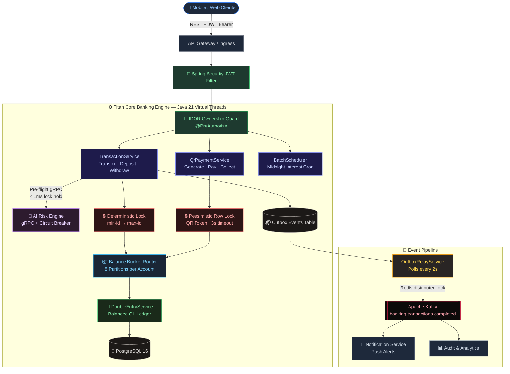

<div align="center">

# 🏛️ Titan Core Banking Engine V2

**Enterprise-grade, high-frequency core banking system built for production.**

[](https://openjdk.org/)
[](https://spring.io/projects/spring-boot)
[](https://www.postgresql.org/)
[](https://kafka.apache.org/)
[](https://redis.io/)
[](#)
[](https://k6.io/)
[](#)
[](#)

<br/>

> Titan Core Banking V2 is a **production-ready**, modular banking engine designed to process thousands of concurrent financial transactions with **100% ACID compliance**, **zero deadlocks**, and **zero unauthorized access** — verified under real load with Grafana k6.

<br/>

**[View Architecture](#-system-architecture) · [Core Innovations](#-core-architectural-innovations) · [Benchmarks](#-stress-testing--benchmarks) · [API Reference](#-api-reference) · [Quick Start](#-quick-start)**

</div>

---

## 📋 Table of Contents

- [💡 Why This Project Exists](#-why-this-project-exists)
- [🧰 Technology Stack](#-technology-stack)
- [🏛️ System Architecture](#-system-architecture)
- [⚡ Core Architectural Innovations](#-core-architectural-innovations)
  - [1 · Deterministic Lock Ordering — Zero Deadlocks](#1--deterministic-lock-ordering--zero-deadlocks)
  - [2 · Partitioned Balance Bucketing — Hot Account Scalability](#2--partitioned-balance-bucketing--hot-account-scalability)
  - [3 · Transactional Outbox Pattern — Guaranteed Event Delivery](#3--transactional-outbox-pattern--guaranteed-event-delivery)
  - [4 · gRPC AI Risk Engine — Pre-flight Fraud Detection](#4--grpc-ai-risk-engine--pre-flight-fraud-detection)
  - [5 · Pessimistic Lock on QR Redemption — Double-Spend Prevention](#5--pessimistic-lock-on-qr-redemption--double-spend-prevention)
  - [6 · Double-Entry General Ledger — Balanced Books](#6--double-entry-general-ledger--balanced-books)
  - [7 · IDOR Protection & Zero Credential Leakage](#7--idor-protection--zero-credential-leakage)
- [🛡️ Security Architecture](#️-security-architecture)
- [📊 Stress Testing & Benchmarks](#-stress-testing--benchmarks)
- [📚 API Reference](#-api-reference)
- [🚀 Quick Start](#-quick-start)
- [🗂️ Project Structure](#️-project-structure)

---

## 💡 Why This Project Exists

Most banking demos are CRUD apps. This is not.

Real banking systems fail in specific, hard-to-reproduce ways:
- **Deadlocks** when two threads transfer money between the same pair of accounts simultaneously
- **Double-spend** when the same QR code is scanned twice in parallel
- **Hot account contention** when a merchant receives hundreds of payments per second
- **Phantom notifications** when Kafka publishes before the database commits
- **IDOR vulnerabilities** when users guess account IDs in API calls

This project solves every one of those problems with provable, code-level solutions — then verifies them under 60-VU concurrent load.

---

## 🧰 Technology Stack

| Category | Technology | Purpose |
|---|---|---|
| **Runtime** | Java 21 LTS — Virtual Threads | 10,000+ concurrent requests without thread pool exhaustion |
| **Framework** | Spring Boot 3.2.3 | Web, Security, JPA, Batch, Scheduling |
| **Database** | PostgreSQL 16 + Flyway | ACID transactions, 25 versioned migrations |
| **Cache** | Redis 7.2 | Idempotency keys, distributed outbox lock |
| **Messaging** | Apache Kafka (KRaft) | Async event streaming, no Zookeeper |
| **RPC** | gRPC + Protocol Buffers | Low-latency AI Risk Engine calls |
| **Security** | Spring Security + JJWT 0.11.5 | Stateless JWT auth, method-level IDOR guards |
| **Fault Tolerance** | Resilience4j 2.2.0 | Circuit Breaker, Retry, Bulkhead |
| **Observability** | Micrometer + OpenTelemetry + Zipkin | Distributed tracing, Prometheus metrics |
| **QR Codes** | Google ZXing 3.5.3 | QR image generation (300×300 PNG → Base64) |
| **Load Testing** | Grafana k6 | Concurrency, security, and TPS benchmarks |
| **Containerization** | Docker Compose | Full-stack local environment |
| **Build** | Maven 3.9 | Dependency management, protobuf codegen |

---

## 🏛️ System Architecture



---

## ⚡ Core Architectural Innovations

### 1 · Deterministic Lock Ordering — Zero Deadlocks

**The Problem:**
When User A transfers to User B and User B transfers to User A at the same millisecond, both threads try to lock the same two rows in opposite order. This creates a circular dependency — PostgreSQL raises error `40P01` (deadlock detected) and rolls back one transaction.

**The Solution:**
Every multi-account operation acquires row locks in **ascending primary key order** — guaranteed, without exception.

```java
// TransactionService.executeSecureTransfer()
Long firstLockId  = Math.min(rawFrom.getId(), rawTo.getId());
Long secondLockId = Math.max(rawFrom.getId(), rawTo.getId());

Account firstLocked  = accountRepository.findByIdWithLock(firstLockId).orElseThrow(...);
Account secondLocked = accountRepository.findByIdWithLock(secondLockId).orElseThrow(...);
```

This pattern is enforced identically in `TransactionService`, `QrPaymentService`, and `BatchScheduler` — every money-movement path in the system.

**The Result:**
```
Deadlocks detected across 1,968 concurrent operations: 0
```

---

### 2 · Partitioned Balance Bucketing — Hot Account Scalability

**The Problem:**
A merchant account receiving 500 simultaneous QR payments creates a serialized queue on one PostgreSQL row. All 500 threads wait for the same row lock — throughput collapses.

**The Solution:**
Each account has **8 sub-bucket rows** (`account_buckets` table). Incoming credits are routed to a pseudo-random bucket:

```java
// AccountBucketService
public int selectRandomBucketIndex() {
    return ThreadLocalRandom.current().nextInt(NUM_BUCKETS); // NUM_BUCKETS = 8
}

public AccountBucket creditBucket(Long parentAccountId, int bucketIndex, BigDecimal amount) {
    // Acquires lock on ONE specific bucket row — not the parent account
    AccountBucket bucket = accountBucketRepository
        .findByParentAccountIdAndBucketIndexWithLock(parentAccountId, bucketIndex)
        .orElseThrow(...);
    bucket.setBalance(bucket.getBalance().add(amount));
    return accountBucketRepository.save(bucket);
}
```

**Balance reads** aggregate dynamically:

```
Total Balance = parent.balance + Σ(bucket[0..7].balance)
```

A scheduled background task sweeps bucket balances back to the parent every 60 seconds using ordered row locks for consistency.

---

### 3 · Transactional Outbox Pattern — Guaranteed Event Delivery

**The Problem:**
Publishing a Kafka event inside a database transaction is a distributed systems trap. If the DB commits but Kafka is temporarily down, the event is lost. If Kafka publishes before the DB commits, consumers see phantom transactions.

**The Solution:**
The outbox pattern makes event delivery an ACID guarantee, not a best-effort:

```
1. TransactionService commits DB changes
2. In the SAME transaction → writes event to outbox_events table
3. OutboxRelayService polls every 2s → reads unpublished events → publishes to Kafka
4. On success → marks event published=true
5. On failure → increments retry_count (max 5 retries, then dead-letter)
```

For TRANSFER transactions, **two outbox events** are created per transaction — one for the sender and one for the receiver — so both parties receive push notifications.

**Redis distributed lock** prevents duplicate processing across horizontal pod replicas:

```java
Boolean acquired = redisTemplate.opsForValue()
    .setIfAbsent(LOCK_KEY, timestamp, Duration.ofSeconds(10));
// Falls back to AtomicBoolean when Redis is unavailable
```

---

### 4 · gRPC AI Risk Engine — Pre-flight Fraud Detection

**The Problem:**
Running risk analysis *inside* a database transaction means the row lock is held while waiting for a network call — potentially for 100ms+. This serializes all transactions behind the slowest risk check.

**The Solution:**
The AI Risk Engine call happens **before** any row lock is acquired:

```java
// RiskEngineGrpcService — called BEFORE findByIdWithLock()
@CircuitBreaker(name = "risk-engine", fallbackMethod = "fallbackRiskCheck")
public RiskCheckResponse analyzeTransaction(String userId, double amount) {
    return riskStub
        .withDeadlineAfter(deadlineMs, TimeUnit.MILLISECONDS) // 100ms hard deadline
        .checkRisk(RiskCheckRequest.newBuilder()
            .setUserId(userId)
            .setAmount(amount)
            .build());
}
```

If the AI service is unreachable, **Resilience4j circuit breaker** opens after 50% failure rate and routes to a local fallback rule engine — the transaction system never goes down because of an AI service outage.

| Scenario | Behavior |
|---|---|
| Risk score → `BLOCK` | Transaction saved as `BLOCKED`, no funds moved |
| Risk score → `ALLOW` | Proceeds to acquire row locks |
| AI service down | Circuit breaker fallback — local amount threshold applied |

---

### 5 · Pessimistic Lock on QR Redemption — Double-Spend Prevention

**The Problem:**
Two users scan the same single-use QR code within milliseconds of each other. Without a lock, both reads see status=`PENDING`, both proceed to move funds — same money paid twice.

**The Solution:**
The QR token row is locked with a pessimistic write lock before any status check:

```java
// QrPaymentRepository
@Lock(LockModeType.PESSIMISTIC_WRITE)
@QueryHints({@QueryHint(name = "jakarta.persistence.lock.timeout", value = "3000")})
@Query("SELECT q FROM QrPayment q WHERE q.qrCode = :qrCode")
Optional<QrPayment> findByQrCodeWithLock(@Param("qrCode") String qrCode);
```

The second concurrent scan blocks for up to 3 seconds waiting for the lock. When it acquires it, the status is already `COMPLETED` — the check fails and the payment is rejected. **One payment, guaranteed.**

---

### 6 · Double-Entry General Ledger — Balanced Books

Every single money movement creates two immutable ledger entries — a DEBIT and a CREDIT. The accounting equation is enforced in code:

```
Assets = Liabilities + Equity
```

**For daily interest payouts** (midnight cron, `Asia/Phnom_Penh`):

```java
// DEBIT  → Bank's Interest Expense GL Account  (bank's expense increases)
// CREDIT → Customer's Deposit Account          (customer's balance increases)

BigDecimal dailyInterest = customerBalance
    .multiply(apy)
    .divide(DAYS_IN_YEAR, 2, RoundingMode.HALF_EVEN); // Banker's Rounding
```

Accounts are processed in **paginated batches of 500** (`PageRequest.of(page, 500)`) with each account running in `Propagation.REQUIRES_NEW` — one failure never rolls back the entire batch.

---

### 7 · IDOR Protection & Zero Credential Leakage

**IDOR Prevention** — Every account endpoint is guarded at the method level, not just the URL:

```java
@GetMapping("/{id}")
@PreAuthorize("@accountSecurity.isAccountOwner(authentication, #id) or hasRole('ADMIN')")
public ResponseEntity<Account> getAccountById(@PathVariable Long id) { ... }
```

`AccountSecurity.isAccountOwner()` queries the database and verifies the authenticated principal owns the account. Guessing another user's account ID returns `403 Forbidden`.

**Credential Protection** — Passwords and PINs are structurally prevented from appearing in API responses or application logs:

```java
// User.java
@JsonProperty(access = JsonProperty.Access.WRITE_ONLY) // never serialized to JSON
@ToString.Exclude                                        // never printed in logs
private String password;

@JsonProperty(access = JsonProperty.Access.WRITE_ONLY)
@ToString.Exclude
private String pin;
```

**PIN Validation Timing** — PIN is validated *after* acquiring the pessimistic row lock, not before. This eliminates a TOCTOU (Time-of-Check/Time-of-Use) race window where a PIN change between the check and the lock could allow unauthorized access.

---

## 🛡️ Security Architecture

```
Request
  │
  ├─► JWT Filter          → validates Bearer token, extracts principal
  │
  ├─► @PreAuthorize       → method-level IDOR ownership check
  │
  ├─► PIN Verification    → matched against bcrypt hash on the locked row
  │
  ├─► Risk Engine gRPC    → AI fraud score — BLOCK / ALLOW / MANUAL_REVIEW
  │
  └─► @AuditLog AOP       → every operation appended to immutable audit log
```

### Global Exception Handler

| Exception | HTTP Status | Client Message |
|:---|:---|:---|
| `MethodArgumentNotValidException` | `400 Bad Request` | Field validation details |
| `InsufficientBalanceException` | `400 Bad Request` | `Business Rule Violation` |
| `SecurityException` / `AccessDeniedException` | `403 Forbidden` | `Access Denied` |
| `CannotCreateTransactionException` | `503 Service Unavailable` | `Service Temporarily Busy` |
| `RedisConnectionFailureException` | `503 Service Unavailable` | `Cache Unavailable` |
| Unhandled `Exception` | `500 Internal Server Error` | Safe generic message |

---

## 📊 Stress Testing & Benchmarks

### Test Configuration

Benchmarked with **Grafana k6** — **60 concurrent Virtual Users** executing a full mixed workload simultaneously: inter-account transfers, QR payments (including double-spend probes), balance reads, deposits, withdrawals, and IDOR attack probes.

### Results

| Metric | Result | Status |
|:---|:---:|:---:|
| Total Operations | **1,902 – 1,968** | ⚡ High Throughput |
| Error Rate | **0.00%** (0 / 1,665 iterations) | ✅ |
| Assertion Checks Passed | **2,824 / 2,824 (100%)** | ✅ |
| Deadlocks Detected | **0** | ✅ |
| Double-Spend Attempts Succeeded | **0** | ✅ |
| IDOR Probes Blocked | **359 / 359 (100% → 403)** | ✅ |
| Account Read Latency (Avg) | **6.99 ms** | ⚡ |
| Account Read Latency (P95) | **10.00 ms** | ⚡ |

### k6 Output

```
  █ THRESHOLDS

    error_rate...................: ✓ 'rate<0.05'  rate=0.00%
    idor_attacks_blocked_403.....: ✓ 'count>0'   count=359

  █ CHECKS

    ✓ IDOR probe blocked (403 Forbidden)       359/359
    ✓ Own account access (200 OK)
    ✓ get accounts 200 OK
    ✓ accounts array returned
    ✓ QR pay 200 OK
    ✓ QR status COMPLETED
    ✓ transfer 200 OK
    ✓ deposit 200 OK
    ✓ withdraw 200 OK

    checks_total.......: 2824    84.79/s
    checks_succeeded...: 100.00% 2824 out of 2824
    checks_failed......: 0.00%   0 out of 2824
```

### Benchmark Screenshots

<table>
  <tr>
    <td></td>
    <td></td>
  </tr>
  <tr>
    <td></td>
    <td></td>
  </tr>
</table>

---

## 📚 API Reference

### Authentication

| Method | Endpoint | Description |
|:---:|:---|:---|
| `POST` | `/api/v1/auth/register` | Register a new bank customer |
| `POST` | `/api/v1/auth/login` | Authenticate and receive JWT Bearer token |

### Accounts

| Method | Endpoint | Description | Auth |
|:---:|:---|:---|:---:|
| `POST` | `/api/v1/accounts` | Open a checking or savings account | JWT |
| `GET` | `/api/v1/accounts` | List all accounts owned by authenticated user | JWT |
| `GET` | `/api/v1/accounts/{id}` | Fetch account by ID *(IDOR protected)* | JWT + Ownership |

### Transactions

| Method | Endpoint | Description | Auth |
|:---:|:---|:---|:---:|
| `POST` | `/api/v1/transactions/transfer` | Inter-account transfer *(deterministic locking)* | JWT + PIN |
| `POST` | `/api/v1/transactions/deposit` | Deposit funds into account | JWT |
| `POST` | `/api/v1/transactions/withdraw` | Withdraw funds from account | JWT + PIN |

### QR Payments

| Method | Endpoint | Description | Auth |
|:---:|:---|:---|:---:|
| `POST` | `/api/v1/qr/generate` | Generate payee QR code (fixed or open amount) | JWT |
| `POST` | `/api/v1/qr/pay` | Pay by scanning a QR code *(pessimistic lock)* | JWT + PIN |
| `POST` | `/api/v1/qr/generate-payer-qr` | Generate pre-authorized send-by-QR | JWT + PIN |
| `POST` | `/api/v1/qr/collect` | Collect pre-authorized QR funds | JWT |
| `GET` | `/api/v1/qr/account/{accountNumber}` | Get permanent account QR code | JWT |

> 📖 Full interactive docs available at `http://localhost:8080/swagger-ui.html` when the application is running.

---

## 🚀 Quick Start

### Prerequisites

- Java 21 LTS — [Eclipse Temurin](https://adoptium.net/) recommended
- Maven 3.9+
- Docker & Docker Compose
- k6 *(optional, for load testing)*

```bash
# Install k6 on macOS
brew install k6
```

### 1 · Start Infrastructure

```bash
docker compose up -d postgres redis kafka
```

Wait for all services to be healthy:

```bash
docker compose ps
```

### 2 · Run the Application

```bash
export JAVA_HOME=/opt/homebrew/opt/openjdk@21
export PATH=$JAVA_HOME/bin:$PATH

mvn spring-boot:run
```

Health check: [http://localhost:8080/actuator/health](http://localhost:8080/actuator/health)  
Swagger UI: [http://localhost:8080/swagger-ui.html](http://localhost:8080/swagger-ui.html)

### 3 · Run Load Tests

```bash
# Full concurrency + security stress suite (60 VUs)
k6 run k6-tests/full-core-banking-suite.js

# Inter-account transfer benchmark
k6 run k6-tests/transfer-money-test.js

# Realistic mixed banking TPS
k6 run k6-tests/realistic-banking-tps.js
```

---

## 🗂️ Project Structure

```
titan-core-banking/
├── src/main/java/com/titan/titancorebanking/
│   ├── config/           # Security, JWT filter, Kafka, gRPC, async config
│   ├── controller/       # REST controllers (Auth, Account, Transaction, QR, ATM, Loan)
│   ├── service/          # Core business logic
│   │   ├── TransactionService.java     # Transfer · Deposit · Withdraw
│   │   ├── QrPaymentService.java       # QR generate · pay · collect
│   │   ├── AccountBucketService.java   # Partition bucketing + sweep
│   │   ├── DoubleEntryService.java     # GL ledger entries
│   │   ├── OutboxRelayService.java     # Kafka event relay
│   │   ├── RiskEngineGrpcService.java  # AI fraud detection
│   │   ├── IdempotencyService.java     # Redis dedup cache
│   │   └── fee/                        # Strategy pattern fee tiers
│   ├── batch/            # Midnight interest calculation cron
│   ├── model/            # JPA entities (Account, Transaction, QrPayment, LedgerEntry ...)
│   ├── repository/       # Spring Data JPA + pessimistic lock queries
│   ├── security/         # AccountSecurity IDOR guard
│   ├── exception/        # GlobalExceptionHandler + domain exceptions
│   ├── aspect/           # AuditLogAspect (AOP cross-cutting)
│   └── dto/              # Request / Response records
├── src/main/proto/
│   └── risk_engine.proto             # gRPC service definition
├── src/main/resources/
│   ├── db/migration/                 # 25 Flyway versioned SQL migrations
│   └── application*.properties       # Environment-specific config
├── k6-tests/                         # Load & security test scripts
├── grafana/                          # Grafana dashboard + datasource config
├── init-db/                          # PostgreSQL init SQL
├── docker-compose.yml                # Full-stack Docker environment
└── Dockerfile                        # Multi-stage production image
```

---

<div align="center">

### Design Patterns Applied

| Pattern | Implementation | Location |
|:---|:---|:---|
| **Strategy** | `FeeStrategy` → `Standard / Gold / Platinum / VIP` tiers | `service/fee/` |
| **Factory** | `FeeStrategyFactory` auto-wired via Spring DI | `service/fee/` |
| **Outbox** | Guaranteed DB-to-Kafka event delivery | `OutboxRelayService` |
| **AOP** | `@AuditLog` annotation → automatic audit trail | `aspect/AuditLogAspect` |
| **Repository** | JPA + custom JPQL with pessimistic locks | `repository/` |
| **Circuit Breaker** | Resilience4j wrapping gRPC risk engine | `RiskEngineGrpcService` |

<br/>

---

<br/>

Made with ☕ and a deep respect for financial correctness.

[](https://openjdk.org/)
[](https://spring.io/)
[](LICENSE)

</div>
