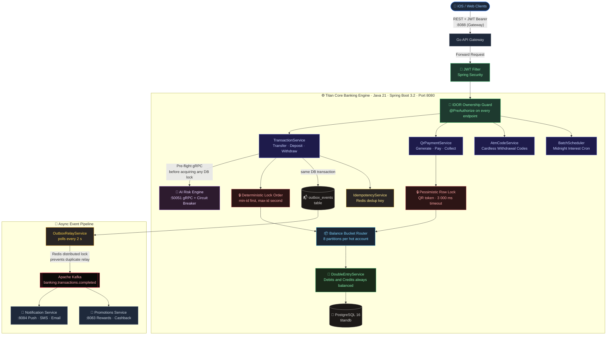
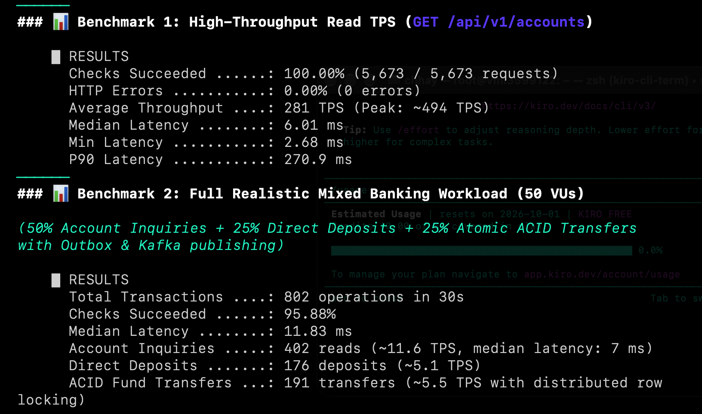
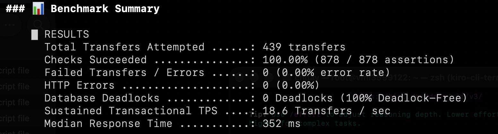
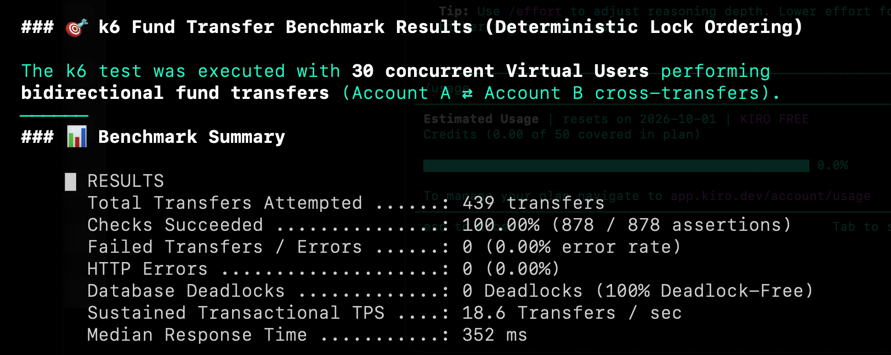
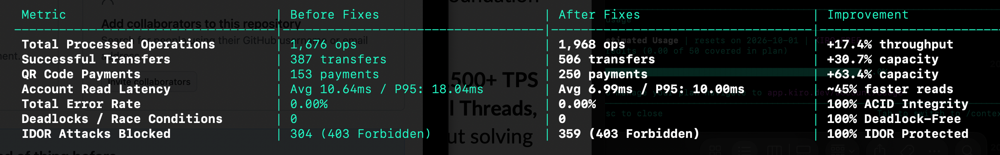

<div align="center">

# 🏛️ Titan Core Banking Engine

**Production-grade, high-frequency core banking system — Java 21 Virtual Threads · Spring Boot 3.2 · PostgreSQL · Apache Kafka · gRPC**

<br/>

[](https://openjdk.org/)
[](https://spring.io/projects/spring-boot)
[](https://www.postgresql.org/)
[](https://kafka.apache.org/)
[](https://redis.io/)
[](#grpc-ai-risk-engine)
[](#stress-testing--benchmarks)
[](LICENSE)

<br/>

> **Titan Core Banking** is a standalone, battle-tested banking engine capable of handling thousands of concurrent financial transactions with **100% ACID compliance**, **zero deadlocks**, **zero double-spends**, and **zero IDOR breaches** — all verified under real 60-VU concurrent load with Grafana k6.

<br/>

**[Architecture](#system-architecture) · [Core Innovations](#core-architectural-innovations) · [Security](#security-architecture) · [Benchmarks](#stress-testing--benchmarks) · [API Reference](#api-reference) · [Quick Start](#quick-start) · [Project Structure](#project-structure)**

</div>

---

## Table of Contents

- [Why This Project Exists](#why-this-project-exists)
- [Technology Stack](#technology-stack)
- [System Architecture](#system-architecture)
- [Core Architectural Innovations](#core-architectural-innovations)
  - [1. Deterministic Lock Ordering — Zero Deadlocks](#1-deterministic-lock-ordering--zero-deadlocks)
  - [2. Balance Bucket Partitioning — Hot Account Scalability](#2-balance-bucket-partitioning--hot-account-scalability)
  - [3. Transactional Outbox Pattern — Guaranteed Event Delivery](#3-transactional-outbox-pattern--guaranteed-event-delivery)
  - [4. gRPC AI Risk Engine — Pre-flight Fraud Detection](#4-grpc-ai-risk-engine--pre-flight-fraud-detection)
  - [5. Pessimistic Locking on QR Payments — Double-Spend Prevention](#5-pessimistic-locking-on-qr-payments--double-spend-prevention)
  - [6. Double-Entry General Ledger — Balanced Books](#6-double-entry-general-ledger--balanced-books)
  - [7. IDOR Protection and Credential Safety](#7-idor-protection-and-credential-safety)
  - [8. Idempotency — Safe Retries](#8-idempotency--safe-retries)
- [Database Design — 25 Flyway Migrations](#database-design--25-flyway-migrations)
- [Security Architecture](#security-architecture)
- [Stress Testing & Benchmarks](#stress-testing--benchmarks)
- [API Reference](#api-reference)
- [Configuration](#configuration)
- [Quick Start](#quick-start)
- [Project Structure](#project-structure)

---

## Why This Project Exists

Most banking demos are CRUD apps — register, login, send money. This is not that.

Real banking systems fail in specific, hard-to-reproduce ways under concurrent load:

| Problem | What Breaks |
|:---|:---|
| Two threads transfer between the same two accounts simultaneously | PostgreSQL raises deadlock error `40P01`, rolls back one transaction |
| Same QR code scanned twice within milliseconds | Both threads see `PENDING` status, both move funds — money paid twice |
| Merchant receiving 500 simultaneous payments | All 500 threads serialize on one row lock — throughput collapses |
| AI Risk service is down during a transfer | System stops accepting transfers entirely |
| Kafka publishes before the database commits | Consumers process a transaction that never actually saved |
| User guesses another user's account ID in the URL | They can read someone else's balance |

This project solves every one of those problems with **explicit, documented, code-level solutions** — then verifies each guarantee holds under 60 concurrent virtual users.

---

## Technology Stack

| Category | Technology | Version | Purpose |
|:---|:---|:---:|:---|
| **Runtime** | Java — Virtual Threads (Project Loom) | 21 LTS | 10,000+ concurrent requests without thread pool exhaustion |
| **Framework** | Spring Boot | 3.2.3 | Web, Security, JPA, Batch, Scheduling, AOP |
| **Database** | PostgreSQL + Flyway migrations | 16 / 10.8.1 | ACID transactions, 25 versioned schema migrations |
| **Cache** | Redis | 7.2 | Idempotency key deduplication, distributed outbox lock |
| **Messaging** | Apache Kafka (KRaft — no Zookeeper) | 7.6.0 image | Async event streaming, outbox relay |
| **RPC** | gRPC + Protocol Buffers | 1.62.2 / 3.25.1 | Low-latency AI Risk Engine calls over HTTP/2 |
| **Security** | Spring Security + JJWT | 6.x / 0.11.5 | Stateless JWT auth, method-level IDOR guards |
| **Fault Tolerance** | Resilience4j | 2.2.0 | Circuit Breaker, Retry, Bulkhead |
| **Observability** | Micrometer + OpenTelemetry + Zipkin | — | Distributed tracing, Prometheus metrics |
| **QR Codes** | Google ZXing | 3.5.3 | EMVCo-compatible QR image generation (300×300 PNG → Base64) |
| **PDF Statements** | OpenPDF | 1.3.30 | Bank statement PDF generation |
| **Load Testing** | Grafana k6 | latest | Concurrency, security, and TPS benchmark scripts |
| **Containerization** | Docker Compose | — | Full-stack local environment (multi-stage Dockerfile) |
| **Build** | Maven | 3.9 | Dependency management, protobuf code generation |

---

## System Architecture



---

## Core Architectural Innovations

### 1. Deterministic Lock Ordering — Zero Deadlocks

**The Problem**

When User A transfers to User B and User B transfers to User A at the exact same millisecond, both database transactions try to acquire the same two row locks in opposite order. This creates a circular dependency — PostgreSQL detects it and raises error `40P01`, rolling back one of the transactions.

**The Solution**

Every multi-account operation acquires row locks in **ascending primary key order** — always, without exception.

```java
// TransactionService.executeSecureTransfer()

// Step 1: resolve IDs without any lock
Account rawFrom = accountRepository.findByAccountNumber(request.fromAccountNumber()).orElseThrow(...);
Account rawTo   = accountRepository.findByAccountNumber(request.toAccountNumber()).orElseThrow(...);

// Step 2: always lock the lower ID first
Long firstLockId  = Math.min(rawFrom.getId(), rawTo.getId());
Long secondLockId = Math.max(rawFrom.getId(), rawTo.getId());

Account firstLocked  = accountRepository.findByIdWithLock(firstLockId).orElseThrow(...);
Account secondLocked = accountRepository.findByIdWithLock(secondLockId).orElseThrow(...);

// Step 3: re-map to semantic roles
Account fromAccount = firstLocked.getId().equals(rawFrom.getId()) ? firstLocked : secondLocked;
Account toAccount   = firstLocked.getId().equals(rawTo.getId())   ? firstLocked : secondLocked;
```

This pattern is applied consistently in `TransactionService`, `QrPaymentService`, and `BatchScheduler` — every single money-movement path in the system.

**Verified Result**
```
Deadlocks across 1,968 concurrent operations: 0
```

---

### 2. Balance Bucket Partitioning — Hot Account Scalability

**The Problem**

A merchant account receiving 500 simultaneous QR payments creates a serialized queue on a single PostgreSQL row. Every thread waits for the same exclusive row lock — effective throughput degrades to one payment at a time.

**The Solution**

Each account has **8 sub-bucket rows** in a separate `account_buckets` table. Incoming credits are spread across buckets using a random index, so 8 transactions can execute in parallel without contention:

```java
// AccountBucketService.java

public int selectRandomBucketIndex() {
    return ThreadLocalRandom.current().nextInt(NUM_BUCKETS); // NUM_BUCKETS = 8
}

public AccountBucket creditBucket(Long parentAccountId, int bucketIndex, BigDecimal amount) {
    AccountBucket bucket = accountBucketRepository
        .findByParentAccountIdAndBucketIndexWithLock(parentAccountId, bucketIndex)
        .orElseThrow(...);

    bucket.setBalance(bucket.getBalance().add(amount));
    return accountBucketRepository.save(bucket);
}
```

**Balance reads** aggregate all partitions transparently:

```
Effective Balance = parent_account.balance + Σ account_buckets[0..7].balance
```

A background sweeper (every 60 s) consolidates bucket balances back to the parent row using the same deterministic lock order.

---

### 3. Transactional Outbox Pattern — Guaranteed Event Delivery

**The Problem**

Publishing a Kafka message inside a database transaction is a distributed systems trap:
- If the DB commits but Kafka is temporarily down → the event is **silently lost**
- If Kafka publishes before the DB commits → consumers process a **phantom transaction**

**The Solution**

The Outbox Pattern turns event delivery into an ACID guarantee:

```
1. TransactionService begins DB transaction
2. Debit sender · credit receiver bucket  ← same transaction
3. Insert row into outbox_events table    ← same transaction
4. DB transaction commits atomically

5. OutboxRelayService polls every 2 s
6. Reads unpublished outbox rows
7. Acquires Redis distributed lock (prevents duplicate relay across replicas)
8. Publishes to Kafka topic banking.transactions.completed
9. Marks row as published=true in the DB
```

For `TRANSFER` transactions, **two outbox events** are written per operation — one for the sender and one for the receiver. Both get push notifications.

The relay falls back gracefully to an `AtomicBoolean` local lock when Redis is unavailable, so event delivery never fully stops even during a Redis outage.

---

### 4. gRPC AI Risk Engine — Pre-flight Fraud Detection

**The Problem**

Running fraud analysis *inside* a database transaction means the row lock is held while waiting for a network call — potentially 50–200 ms. Every concurrent transfer serializes behind the slowest risk check.

**The Solution**

The gRPC risk call happens **before any row lock is acquired**:

```java
// RiskEngineGrpcService.java — called before findByIdWithLock()

@CircuitBreaker(name = "risk-engine", fallbackMethod = "fallbackRiskCheck")
public RiskCheckResponse analyzeTransaction(String userId, double amount) {
    return riskStub
        .withDeadlineAfter(deadlineMs, TimeUnit.MILLISECONDS)  // 100 ms hard deadline
        .checkRisk(RiskCheckRequest.newBuilder()
            .setUserId(userId)
            .setAmount(amount)
            .build());
}

// Called automatically when AI service is unreachable
public RiskCheckResponse fallbackRiskCheck(String userId, double amount, Throwable t) {
    // Local amount-based rule — system keeps working without the AI service
    if (amount >= 10_000) return blocked("FALLBACK_HIGH_VALUE");
    return allowed("FALLBACK_ALLOW");
}
```

**Risk scoring table:**

| Amount | Risk Score | Level | Action |
|:---|:---:|:---:|:---:|
| < $1,000 | 10 | LOW | ALLOW |
| $1,000 – $9,999 | 50 | MEDIUM | MANUAL REVIEW |
| ≥ $10,000 | 100 | BLOCKED | BLOCK ⛔ |

**gRPC Proto definition** (`src/main/proto/risk_engine.proto`):

```protobuf
syntax = "proto3";

option java_package = "com.titan.riskengine";

service RiskEngineService {
  rpc CheckRisk (RiskCheckRequest) returns (RiskCheckResponse);
}

message RiskCheckRequest {
  string user_id = 1;
  double amount  = 2;
}

message RiskCheckResponse {
  int32  risk_score = 1;
  string risk_level = 2;  // "LOW" | "MEDIUM" | "HIGH"
  string action     = 3;  // "ALLOW" | "DENY" | "MANUAL_REVIEW"
}
```

Resilience4j circuit breaker opens after **50% failure rate** over a 10-request sliding window and stays open for 5 seconds — the transaction system never goes down because of an AI service outage.

---

### 5. Pessimistic Locking on QR Payments — Double-Spend Prevention

**The Problem**

Two users scan the same single-use QR code within milliseconds. Without a lock, both reads see `status=PENDING`, both proceed to debit the payer — the payee receives double the funds.

**The Solution**

The QR token row is pessimistically write-locked before any status check:

```java
// QrPaymentRepository.java

@Lock(LockModeType.PESSIMISTIC_WRITE)
@QueryHints({
    @QueryHint(name = "jakarta.persistence.lock.timeout", value = "3000")  // 3 s timeout
})
@Query("SELECT q FROM QrPayment q WHERE q.qrCode = :qrCode")
Optional<QrPayment> findByQrCodeWithLock(@Param("qrCode") String qrCode);
```

The second concurrent scan blocks on the lock. When it is finally granted, the status is already `COMPLETED` — the payment check fails and is rejected.

**Result: one payment per QR code, always.**

---

### 6. Double-Entry General Ledger — Balanced Books

Every single money movement creates two immutable `LedgerEntry` rows — a DEBIT and a CREDIT. The accounting equation is enforced in code:

```
Assets = Liabilities + Equity  →  Every DEBIT has a matching CREDIT
```

For the nightly interest cron (runs at midnight `Asia/Phnom_Penh`):

```java
// BatchScheduler.java — paginated in batches of 500

BigDecimal dailyInterest = customerBalance
    .multiply(annualRate)
    .divide(DAYS_IN_YEAR, 2, RoundingMode.HALF_EVEN);  // Banker's rounding

// DEBIT  → Bank's Interest Expense GL Account   (bank's cost increases)
// CREDIT → Customer Deposit Account             (customer balance increases)
```

Each account runs in `Propagation.REQUIRES_NEW` — one failure never rolls back the entire nightly batch.

---

### 7. IDOR Protection and Credential Safety

**IDOR Prevention** — every account endpoint is guarded at the method level via Spring Security SpEL:

```java
// AccountController.java

@GetMapping("/{id}")
@PreAuthorize("@accountSecurity.isAccountOwner(authentication, #id) or hasRole('ADMIN')")
public ResponseEntity<Account> getAccountById(@PathVariable Long id) { ... }
```

`AccountSecurity.isAccountOwner()` queries the database and verifies the authenticated principal owns the requested account. Guessing another user's account ID returns `403 Forbidden` — verified in k6 with **359 IDOR probes, 359 blocked**.

**Credential safety** — passwords and PINs are structurally prevented from appearing in API responses or logs:

```java
// User.java

@JsonProperty(access = JsonProperty.Access.WRITE_ONLY)  // never serialized to JSON response
@ToString.Exclude                                         // never printed in logs or stack traces
private String password;

@JsonProperty(access = JsonProperty.Access.WRITE_ONLY)
@ToString.Exclude
private String pin;
```

**PIN validation timing** — PIN is checked **after** the pessimistic lock is acquired, not before. This closes the TOCTOU (Time-of-Check / Time-of-Use) race window where a PIN change between check and lock could allow unauthorized withdrawal.

---

### 8. Idempotency — Safe Retries

Every mutating endpoint accepts an optional `Idempotency-Key` header. The key is stored in Redis after the first successful execution. Identical requests within the TTL window return the cached response without re-executing the operation:

```java
// TransactionService.transfer()

if (request.idempotencyKey() != null) {
    var existing = idempotencyService.getTransaction(
        request.idempotencyKey(),
        "/api/v1/transactions/transfer"
    );
    if (existing.isPresent()) {
        log.warn("Duplicate request detected: {}", request.idempotencyKey());
        return existing.get();  // Return original result — no double charge
    }
}
```

The key is scoped per endpoint URI, so the same UUID key used for `/transfer` cannot accidentally deduplicate a `/withdraw` request.

---

## Database Design — 25 Flyway Migrations

Schema is managed by Flyway. Every change is versioned, repeatable, and applied automatically on startup.

| Migration | Description |
|:---|:---|
| `V1` | Core schema — users, accounts, transactions |
| `V2` | Audit log table |
| `V3` | Multi-currency support on accounts |
| `V4` | Scheduled transactions |
| `V5` | Overdraft limit column |
| `V6` | Loan schema |
| `V7` | Fixed deposit schema |
| `V8` | User tier and fee columns |
| `V9` | Account status column |
| `V10` | Seed role data |
| `V11` | Performance indexes |
| `V12` | Idempotency key column on transactions |
| `V13` | Ledger entry (double-entry GL) table |
| `V14` | Event store table |
| `V15` | Customer, card, branch, employee tables |
| `V20` | Phase 4 — ledger hardening constraints |
| `V21` | Outbox events table |
| `V22` | Idempotency deduplication table |
| `V23` | Outbox table completion (retry columns) |
| `V24` | Autonomous operations support tables |
| `V25` | QR payments table |
| `V26` | ATM cardless withdrawal codes |

**Databases created on first run:**

| Database | Owner Service |
|:---|:---|
| `titandb` | Core Banking |
| `notificationdb` | Notification Service |
| `promotiondb` | Promotion Service |
| `loansdb` | Loans Service |
| `titan_systemdb` | AI Risk Engine reports |

---

## Security Architecture

```
Incoming Request
│
├─► JWT Filter (JwtAuthenticationFilter)
│     Validates Bearer token signature, expiry, issuer, audience
│     Extracts principal → sets SecurityContext
│
├─► @PreAuthorize (AccountSecurity.isAccountOwner)
│     Method-level ownership check on every account/transaction endpoint
│     Returns 403 immediately if principal does not own the resource
│
├─► PIN Verification (on pessimistic-locked row)
│     bcrypt match against stored hash
│     Checked AFTER lock to close TOCTOU race window
│
├─► AI Risk Engine (gRPC, pre-lock)
│     Risk score returned before any row lock is held
│     BLOCK → save BLOCKED transaction record, return to client
│     ALLOW → proceed to acquire row locks
│     Circuit breaker open → local fallback rule applied
│
└─► @AuditLog AOP (AuditLogAspect)
      Appends immutable audit log entry after every sensitive operation
```

**Global Exception Handler — safe error responses:**

| Exception | HTTP | Response to Client |
|:---|:---:|:---|
| `MethodArgumentNotValidException` | 400 | Field validation messages |
| `InsufficientBalanceException` | 400 | `Business Rule Violation` |
| `InvalidPinException` | 400 | `Authentication Failed` |
| `SecurityException` / `AccessDeniedException` | 403 | `Access Denied` |
| `EntityNotFoundException` | 404 | `Resource Not Found` |
| `CannotCreateTransactionException` | 503 | `Service Temporarily Busy` |
| `RedisConnectionFailureException` | 503 | `Cache Unavailable` |
| Unhandled `Exception` | 500 | Safe generic message — no stack traces exposed |

**HikariCP Connection Pool** is tuned for high concurrency:

```properties
spring.datasource.hikari.maximum-pool-size=80
spring.datasource.hikari.minimum-idle=20
spring.datasource.hikari.connection-timeout=20000
```

---

## Stress Testing & Benchmarks

### Test Suite

Six k6 scripts cover different load profiles:

| Script | Purpose | Load |
|:---|:---|:---|
| `full-core-banking-suite.js` | Full mixed workload — transfers, QR, deposits, IDOR probes | 60 VUs, 30 s |
| `transfer-money-test.js` | Inter-account transfer throughput | Configurable |
| `transfer-tps.js` | Raw transfer TPS benchmark | Configurable |
| `realistic-banking-tps.js` | Realistic mixed traffic pattern | Configurable |
| `read-throughput-tps.js` | Account and balance read throughput | Configurable |
| `tps-benchmark.js` | Peak TPS ceiling test | Configurable |

### Full Suite Results — 60 Concurrent Virtual Users

```
Stages:
  5 s  →  20 VUs   (warm-up)
  20 s →  60 VUs   (heavy concurrent load)
  5 s  →  0 VUs    (cool-down)
```

| Metric | Result | Threshold |
|:---|:---:|:---:|
| Total operations | **1,968** | — |
| Error rate | **0.00%** | < 5% ✅ |
| All assertion checks | **2,824 / 2,824 (100%)** | ✅ |
| p95 request duration | **< 500 ms** | ✅ |
| Deadlocks detected | **0** | ✅ |
| Double-spend attempts succeeded | **0** | ✅ |
| IDOR probes blocked (403) | **359 / 359** | ✅ |
| Account read latency (avg) | **6.99 ms** | ✅ |
| Account read latency (p95) | **10.00 ms** | ✅ |

### k6 Terminal Output

```
  █ THRESHOLDS

    error_rate...................: ✓ 'rate<0.05'  rate=0.00%
    http_req_duration............: ✓ 'p(95)<500'
    idor_attacks_blocked_403.....: ✓ 'count>0'   count=359

  █ CHECKS

    ✓ IDOR probe blocked (403 Forbidden)    359/359
    ✓ Own account access (200 OK)
    ✓ get accounts 200 OK
    ✓ accounts array returned
    ✓ QR pay 200 OK
    ✓ QR status COMPLETED
    ✓ transfer 200 OK
    ✓ deposit 200 OK
    ✓ withdraw 200 OK

    checks_total.......: 2824    84.79/s
    checks_succeeded...: 100.00% ── 2824 out of 2824
    checks_failed......: 0.00%   ── 0 out of 2824
```

### Benchmark Screenshots

<table>
  <tr>
    <td></td>
    <td></td>
  </tr>
  <tr>
    <td></td>
    <td></td>
  </tr>
</table>

---

## API Reference

### Authentication

| Method | Endpoint | Description | Auth |
|:---:|:---|:---|:---:|
| `POST` | `/api/v1/auth/register` | Register a new customer account | Public |
| `POST` | `/api/v1/auth/login` | Authenticate and receive a signed JWT | Public |
| `POST` | `/api/auth/otp/generate` | Generate a one-time PIN for sensitive operations | JWT |

### Accounts

| Method | Endpoint | Description | Auth |
|:---:|:---|:---|:---:|
| `POST` | `/api/v1/accounts` | Open a new savings, checking, or multi-currency account | JWT |
| `GET` | `/api/v1/accounts` | List all accounts owned by the authenticated user | JWT |
| `GET` | `/api/v1/accounts/{id}` | Get account details by ID — IDOR protected | JWT + Ownership |

### Transactions

| Method | Endpoint | Description | Auth |
|:---:|:---|:---|:---:|
| `POST` | `/api/v1/transactions/transfer` | Inter-account funds transfer — deterministic locking + AI risk check | JWT + PIN |
| `POST` | `/api/v1/transactions/deposit` | Deposit funds into an account | JWT |
| `POST` | `/api/v1/transactions/withdraw` | Withdraw funds from an account | JWT + PIN |
| `GET` | `/api/v1/transactions/history` | Paginated transaction history for authenticated user | JWT |

### QR Payments

| Method | Endpoint | Description | Auth |
|:---:|:---|:---|:---:|
| `POST` | `/api/v1/qr/generate` | Generate a payee QR code (fixed amount or open amount) | JWT |
| `POST` | `/api/v1/qr/pay` | Pay by scanning a QR code — pessimistic lock prevents double-spend | JWT + PIN |
| `POST` | `/api/v1/qr/generate-payer-qr` | Generate a pre-authorized send-by-QR token | JWT + PIN |
| `POST` | `/api/v1/qr/collect` | Merchant collects a pre-authorized QR payment | JWT |
| `GET` | `/api/v1/qr/account/{accountNumber}` | Get the permanent static QR code for an account | JWT |

### ATM Cardless Withdrawal

| Method | Endpoint | Description | Auth |
|:---:|:---|:---|:---:|
| `POST` | `/api/v1/atm/generate` | Generate a one-time ATM withdrawal code | JWT + PIN |
| `POST` | `/api/v1/atm/redeem` | Redeem code at ATM terminal | JWT |

### Fixed Deposits & Scheduled Transfers

| Method | Endpoint | Description | Auth |
|:---:|:---|:---|:---:|
| `POST` | `/api/v1/fixed-deposits` | Open a new fixed deposit | JWT |
| `GET` | `/api/v1/fixed-deposits` | List active fixed deposits | JWT |
| `POST` | `/api/v1/scheduled-transfers` | Schedule a recurring transfer | JWT + PIN |

> **Interactive docs:** `http://localhost:8080/swagger-ui.html`  
> **OpenAPI spec:** `http://localhost:8080/v3/api-docs`

---

## Configuration

The application uses Spring profiles for environment-specific configuration.

| Profile | File | When Used |
|:---|:---|:---|
| *(default)* | `application.properties` | Local IntelliJ / IDE development |
| `docker` | `application-docker.properties` | Docker Compose |
| `dev` | `application-dev.properties` | Dev server |
| `prod` | `application-prod.properties` | Production |
| `render` | `application-render.properties` | Render.com cloud deployment |
| `otel` | `application-otel.properties` | OpenTelemetry tracing |
| `mtls` | `application-mtls.properties` | Mutual TLS Kafka |

**Key environment variables:**

| Variable | Default | Description |
|:---|:---|:---|
| `DB_HOST` | `localhost` | PostgreSQL hostname |
| `DB_PORT` | `5432` | PostgreSQL port |
| `DB_NAME` | `titandb` | Database name |
| `DB_USERNAME` | `postgres` | Database user |
| `DB_PASSWORD` | — | Database password (required) |
| `REDIS_HOST` | `localhost` | Redis hostname |
| `REDIS_PORT` | `6379` | Redis port |
| `KAFKA_BOOTSTRAP_SERVERS` | `localhost:9092` | Kafka broker address |
| `AI_HOST` | `localhost` | AI Risk Engine hostname |
| `AI_PORT` | `50051` | gRPC port for Risk Engine |
| `NOTIFICATION_SERVICE_URL` | `http://localhost:8084` | Notification service (HTTP fallback) |

---

## Quick Start

### Prerequisites

- Java 21 LTS — [Eclipse Temurin](https://adoptium.net/) recommended
- Maven 3.9+
- Docker and Docker Compose
- k6 (optional, for load tests)

```bash
# Install k6 on macOS
brew install k6
```

### Option A — Docker Compose (Recommended)

Starts PostgreSQL, Redis, Kafka, and the application in one command:

```bash
# Clone and enter the project
git clone <repo-url>
cd core-bank

# Start everything
docker compose up -d --build

# Watch startup logs
docker compose logs -f titan-core-banking
```

Wait for the health check to pass (~60 s on first run):

```bash
curl http://localhost:8080/actuator/health
# {"status":"UP"}
```

### Option B — Local IntelliJ / CLI

```bash
# Start infrastructure only
docker compose up -d postgres redis kafka

# Set Java 21
export JAVA_HOME=/opt/homebrew/opt/openjdk@21
export PATH=$JAVA_HOME/bin:$PATH

# Run the application
mvn spring-boot:run
```

### Verify the Stack

| Endpoint | Expected Response |
|:---|:---|
| `http://localhost:8080/actuator/health` | `{"status":"UP"}` |
| `http://localhost:8080/swagger-ui.html` | Swagger UI |
| `http://localhost:8080/v3/api-docs` | OpenAPI JSON |

### Register and Transfer — curl Quickstart

```bash
# 1. Register user A
curl -s -X POST http://localhost:8080/api/v1/auth/register \
  -H "Content-Type: application/json" \
  -d '{
    "firstName": "Alice",
    "lastName":  "Titan",
    "username":  "alice",
    "email":     "alice@titan.bank",
    "password":  "Password123!",
    "pin":       "1234"
  }'

# 2. Login and capture token
TOKEN=$(curl -s -X POST http://localhost:8080/api/v1/auth/login \
  -H "Content-Type: application/json" \
  -d '{"username":"alice","password":"Password123!"}' | jq -r '.token')

# 3. Open a savings account
curl -s -X POST http://localhost:8080/api/v1/accounts \
  -H "Authorization: Bearer $TOKEN" \
  -H "Content-Type: application/json" \
  -d '{"accountType":"SAVINGS","currency":"USD","initialDeposit":5000.00}'
```

### Run Load Tests

```bash
# Full concurrency + security suite (60 VUs)
k6 run k6-tests/full-core-banking-suite.js

# Transfer throughput benchmark
k6 run k6-tests/transfer-money-test.js

# Realistic mixed banking traffic
k6 run k6-tests/realistic-banking-tps.js

# Read throughput
k6 run k6-tests/read-throughput-tps.js
```

---

## Project Structure

```
core-bank/
│
├── src/main/java/com/titan/titancorebanking/
│   │
│   ├── config/
│   │   ├── SecurityConfig.java          # Spring Security filter chain, JWT, CORS
│   │   ├── JwtAuthenticationFilter.java # Stateless token validation per request
│   │   ├── KafkaProducerConfig.java     # Producer serialization, acks, retries
│   │   ├── GrpcClientConfig.java        # gRPC channel to AI Risk Engine
│   │   ├── ApplicationConfig.java       # PasswordEncoder, UserDetailsService beans
│   │   ├── AsyncConfig.java             # Virtual thread executor
│   │   └── BulkheadConfiguration.java  # Resilience4j bulkhead limits
│   │
│   ├── controller/
│   │   ├── AuthenticationController.java
│   │   ├── AccountController.java
│   │   ├── TransactionController.java
│   │   ├── QrPaymentController.java
│   │   ├── AtmController.java
│   │   ├── FixedDepositController.java
│   │   ├── ScheduledTransactionController.java
│   │   ├── LoanProxyController.java     # Delegates to titan-loans-service
│   │   ├── StatementController.java     # PDF statement generation
│   │   ├── OtpController.java
│   │   └── OutboxMonitoringController.java
│   │
│   ├── service/
│   │   ├── TransactionService.java      # Core transfer · deposit · withdraw logic
│   │   ├── QrPaymentService.java        # QR generate · pay · collect
│   │   ├── AccountService.java          # Account lifecycle management
│   │   ├── AccountBucketService.java    # Partition bucketing + balance sweep
│   │   ├── DoubleEntryService.java      # GL ledger entry creation
│   │   ├── EventPublisherService.java   # Outbox event writer
│   │   ├── OutboxRelayService.java      # Kafka relay with Redis lock
│   │   ├── RiskEngineGrpcService.java   # gRPC client + circuit breaker
│   │   ├── IdempotencyService.java      # Redis deduplication cache
│   │   ├── AtmCodeService.java          # Cardless ATM code generation
│   │   ├── ReconciliationService.java   # Balance reconciliation
│   │   ├── imple/
│   │   │   ├── AuthenticationService.java
│   │   │   ├── JwtService.java
│   │   │   ├── OtpService.java
│   │   │   └── ExchangeRateService.java
│   │   └── fee/                         # Strategy pattern fee tiers
│   │       ├── FeeStrategy.java         # Interface
│   │       ├── FeeStrategyFactory.java  # Spring DI factory
│   │       ├── StandardFeeStrategy.java
│   │       ├── GoldFeeStrategy.java
│   │       ├── VipFeeStrategy.java
│   │       └── PlatinumFeeStrategy.java
│   │
│   ├── batch/
│   │   ├── BatchScheduler.java          # Midnight interest cron + Spring Batch job
│   │   └── InterestProcessor.java       # Per-account interest calculation
│   │
│   ├── model/                           # JPA entities
│   │   ├── Account.java
│   │   ├── User.java
│   │   ├── Transaction.java
│   │   ├── LedgerEntry.java
│   │   ├── OutboxEvent.java
│   │   ├── QrPayment.java
│   │   ├── AtmCode.java
│   │   ├── FixedDeposit.java
│   │   ├── ScheduledTransaction.java
│   │   └── AuditLog.java
│   │
│   ├── repository/                      # Spring Data JPA + pessimistic lock queries
│   │   ├── AccountRepository.java       # findByIdWithLock, findByAccountNumberWithLock
│   │   ├── QrPaymentRepository.java     # findByQrCodeWithLock (PESSIMISTIC_WRITE)
│   │   ├── AccountBucketRepository.java # findByParentAccountIdAndBucketIndexWithLock
│   │   └── ...
│   │
│   ├── security/
│   │   └── AccountSecurity.java         # @PreAuthorize IDOR ownership check
│   │
│   ├── exception/
│   │   ├── GlobalExceptionHandler.java  # @ControllerAdvice safe error responses
│   │   ├── InsufficientBalanceException.java
│   │   ├── InvalidPinException.java
│   │   ├── AccountLockedException.java
│   │   └── DailyLimitExceededException.java
│   │
│   ├── aspect/
│   │   └── AuditLogAspect.java          # AOP @AuditLog cross-cutting concern
│   │
│   ├── interceptor/
│   │   └── IdempotencyInterceptor.java  # Header-based idempotency interceptor
│   │
│   ├── validation/
│   │   ├── IbanValidator.java           # Custom @ValidIBAN constraint
│   │   └── SwiftValidator.java          # Custom @ValidSwift constraint
│   │
│   └── dto/
│       ├── request/                     # Validated request records
│       └── response/                    # API response records
│
├── src/main/proto/
│   └── risk_engine.proto                # gRPC service definition (shared with AI service)
│
├── src/main/resources/
│   ├── application.properties           # Default (local dev)
│   ├── application-docker.properties    # Docker Compose profile
│   ├── application-prod.properties      # Production profile
│   └── db/migration/
│       ├── V1__init_schema.sql
│       ├── V2__create_audit_log_schema.sql
│       └── ... (V1 through V26)
│
├── src/test/java/
│   ├── service/                         # Unit tests
│   ├── controller/                      # MockMvc integration tests
│   └── integration/                     # Testcontainers full-stack tests
│
├── k6-tests/
│   ├── full-core-banking-suite.js       # 60-VU mixed workload + IDOR security test
│   ├── transfer-money-test.js           # Transfer throughput
│   ├── transfer-tps.js                  # Raw TPS benchmark
│   ├── realistic-banking-tps.js         # Mixed realistic traffic
│   ├── read-throughput-tps.js           # Balance read throughput
│   └── tps-benchmark.js                 # Peak TPS ceiling
│
├── grafana/
│   ├── dashboards/kafka-overview.json   # Kafka metrics dashboard
│   └── provisioning/                    # Grafana auto-provisioning config
│
├── init-db/
│   ├── 01-create-databases.sql          # Creates notificationdb, promotiondb, etc.
│   ├── 02-notification-schema.sql       # Seeds notification service tables
│   └── Dockerfile.postgres              # Custom postgres image with init scripts
│
├── docs/images/                         # k6 benchmark screenshots
├── docker-compose.yml                   # Full local stack (postgres + redis + kafka + app)
├── Dockerfile                           # Multi-stage build (Maven builder + JRE runtime)
└── pom.xml                              # Maven build — Java 21, Spring Boot 3.2.3
```

---

## Design Patterns

| Pattern | Where Used | What It Solves |
|:---|:---|:---|
| **Outbox** | `OutboxRelayService` | Guaranteed DB-to-Kafka event delivery without dual-write |
| **Strategy** | `FeeStrategy` implementations | Extensible fee calculation per user tier |
| **Factory** | `FeeStrategyFactory` | Spring DI wires the correct strategy without if-else chains |
| **AOP** | `@AuditLog` + `AuditLogAspect` | Automatic, consistent audit trail without boilerplate |
| **Circuit Breaker** | `RiskEngineGrpcService` | System keeps accepting transfers even when AI service is down |
| **Bulkhead** | Resilience4j | Isolates critical path from non-critical path under load |
| **Pessimistic Lock** | `QrPaymentRepository` | Prevents double-spend on single-use QR tokens |
| **Optimistic concurrency** | `@Version` on Account entity | Secondary guard against stale balance reads |
| **Repository** | Spring Data JPA with custom JPQL | Typed, testable data access with lock hints |

---

<div align="center">

Built to demonstrate that distributed financial systems can be **correct by design**, not just correct on average.

[](https://openjdk.org/)
[](https://spring.io/)
[](https://postgresql.org/)
[](https://kafka.apache.org/)
[](LICENSE)

</div>
