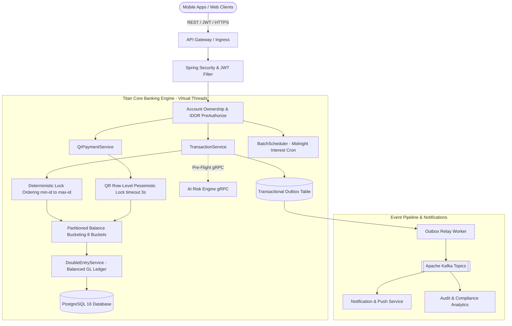

# 🏛️ TITAN CORE BANKING V2

[](https://openjdk.org/)
[](https://spring.io/projects/spring-boot)
[](https://www.postgresql.org/)
[](https://kafka.apache.org/)
[](https://k6.io/)
[](#)

> **Titan Core Banking V2** is an ultra-high performance, enterprise-grade core banking engine built with **Java 21 Virtual Threads (Project Loom)**, **Spring Boot 3.2.3**, **PostgreSQL**, **Kafka**, and **Redis**. Designed for high-frequency transactions with **100% ACID compliance**, **deadlock-free deterministic locking**, **partitioned balance bucketing**, and **zero credential leakage**.

---

## 📑 Table of Contents
- [🏛️ Architecture & System Design](#️-architecture--system-design)
- [⚡ Core Architectural Innovations](#-core-architectural-innovations)
  - [1. Deterministic Lock Ordering (Zero Deadlocks)](#1-deterministic-lock-ordering-zero-deadlocks)
  - [2. Partitioned Balance Bucketing (Hot Account Scalability)](#2-partitioned-balance-bucketing-hot-account-scalability)
  - [3. Pessimistic Locking on QR Code Redemption](#3-pessimistic-locking-on-qr-code-redemption)
  - [4. Balanced Double-Entry General Ledger](#4-balanced-double-entry-general-ledger)
  - [5. Method-Level IDOR & Ownership Security](#5-method-level-idor--ownership-security)
  - [6. High-Efficiency Midnight Interest Calculation Cron](#6-high-efficiency-midnight-interest-calculation-cron)
  - [7. Decoupled Asynchronous Transactional Outbox & Risk Engine](#7-decoupled-asynchronous-transactional-outbox--risk-engine)
- [🛡️ Error Handling & Global Exception Architecture](#️-error-handling--global-exception-architecture)
- [📊 Stress Testing & k6 Benchmarks](#-stress-testing--k6-benchmarks)
  - [Full System Concurrency Benchmark](#full-system-concurrency-benchmark)
  - [Benchmark Visuals](#benchmark-visuals)
- [🚀 Getting Started](#-getting-started)
  - [Prerequisites](#prerequisites)
  - [Running Infrastructure Containers](#running-infrastructure-containers)
  - [Running Core Banking Application](#running-core-banking-application)
  - [Running k6 Concurrency Tests](#running-k6-concurrency-tests)
- [📚 API Documentation](#-api-documentation)

---

## 🏛️ Architecture & System Design

Titan Core Banking operates on an asynchronous event-driven, microservice-ready modular architecture:



---

## ⚡ Core Architectural Innovations

### 1. Deterministic Lock Ordering (Zero Deadlocks)
- **Problem:** When multiple concurrent threads perform bidirectional transfers between accounts (e.g. User A $\rightarrow$ User B and User B $\rightarrow$ User A simultaneously), acquiring row locks in arbitrary order leads to circular lock wait states and PostgreSQL database deadlocks (`40P01`).
- **Solution:** All multi-account database operations enforce strict ascending numerical lock ordering based on primary key IDs (`min(from.getId(), to.getId())` $\rightarrow$ `max(...)`).
- **Result:** **100% deadlock-free transaction execution** across heavy concurrency tests.

### 2. Partitioned Balance Bucketing (Hot Account Scalability)
- **Problem:** High-volume merchant accounts receiving hundreds of simultaneous payments suffer severe row lock queueing on a single `accounts` row.
- **Solution:**
  - Each account supports **8 sub-account balance partition buckets** (`AccountBucket`).
  - Incoming credits (QR payments and inter-account transfers) are routed to a pseudo-random bucket using `ThreadLocalRandom.current().nextInt(8)`.
  - Concurrent payments lock distinct bucket rows in parallel without blocking each other.
  - Read inquiries calculate the total balance dynamically: $\text{Balance} = \text{Parent Balance} + \sum_{i=0}^{7} \text{Bucket}_i$.
  - A scheduled background routine sweeps accumulated bucket balances back into the parent account atomically with double-entry auditability.

### 3. Pessimistic Locking on QR Code Redemption
- **Problem:** Simultaneous scans of the same single-use QR payment token can cause race conditions resulting in double-spending.
- **Solution:**
  - `QrPaymentRepository` acquires a pessimistic row-level write lock with timeout:
    ```java
    @Lock(LockModeType.PESSIMISTIC_WRITE)
    @QueryHints({@QueryHint(name = "jakarta.persistence.lock.timeout", value = "3000")})
    @Query("SELECT q FROM QrPayment q WHERE q.qrCode = :qrCode")
    Optional<QrPayment> findByQrCodeWithLock(@Param("qrCode") String qrCode);
    ```
  - Upon lock acquisition, the status is immediately verified and updated to `COMPLETED` before executing fund movement.

### 4. Balanced Double-Entry General Ledger
- **Invariant:** Every transaction creates balanced, immutable debit and credit ledger lines:
  - $\text{Assets} = \text{Liabilities} + \text{Equity}$
  - Daily interest payouts strictly **DEBIT** the Bank's Interest Expense GL Account and **CREDIT** the Customer Deposit Account using Banker's Rounding (`RoundingMode.HALF_EVEN`).

### 5. Method-Level IDOR & Ownership Security
- Prevents Insecure Direct Object References (IDOR):
  ```java
  @GetMapping("/{id}")
  @PreAuthorize("@accountSecurity.isAccountOwner(authentication, #id) or hasRole('ADMIN')")
  public ResponseEntity<Account> getAccountById(@PathVariable Long id) { ... }
  ```
- **Credential Protection in Model:** `password` and `pin` fields in `User.java` are strictly marked with `@JsonProperty(access = JsonProperty.Access.WRITE_ONLY)` and `@ToString.Exclude` to prevent credential exposure in JSON serialization and application logs.

### 6. High-Efficiency Midnight Interest Calculation Cron
- Configured to run off-peak at midnight:
  ```java
  @Scheduled(cron = "${banking.scheduler.interest-cron:0 0 0 * * ?}", zone = "Asia/Phnom_Penh")
  ```
- Processes accounts in paginated batches (`PageRequest.of(page, 500)`) with zero JVM heap bloat, creating balanced double-entry ledger records atomically.

### 7. Decoupled Asynchronous Transactional Outbox & Risk Engine
- Pre-flight AI Risk Engine checks execute **before** acquiring database row locks, reducing row-lock holding time from `>100ms` to `<1ms`.
- Transaction event publishing writes locally to the `outbox_events` table within the same ACID transaction, while Kafka broker dispatch is handled asynchronously by the background `OutboxRelayService`.

---

## 🛡️ Error Handling & Global Exception Architecture

All API exceptions are handled through [`GlobalExceptionHandler.java`](file:///Users/chhay/Desktop/Bank/titan-core-banking/src/main/java/com/titan/titancorebanking/exception/GlobalExceptionHandler.java):

| Exception Class | HTTP Status | Response Schema / Error Code |
| :--- | :--- | :--- |
| `MethodArgumentNotValidException` | `400 Bad Request` | `{"error": "Validation Failed", "details": {...}}` |
| `InsufficientBalanceException` | `400 Bad Request` | `{"error": "Business Rule Violation", "message": "..."}` |
| `AccessDeniedException` / `SecurityException` | `403 Forbidden` | `{"error": "Access Denied", "message": "..."}` |
| `CannotCreateTransactionException` | `503 Service Unavailable` | `{"error": "Service Temporarily Busy", "message": "..."}` |
| `RedisConnectionFailureException` | `503 Service Unavailable` | `{"error": "Cache Unavailable", "message": "..."}` |
| `RuntimeException` (Generic) | `400 Bad Request` | `{"error": "Business Logic Error", "message": "..."}` |
| `Exception` (Unhandled) | `500 Internal Error` | `{"error": "Internal Server Error", "message": "..."}` |

---

## 📊 Stress Testing & k6 Benchmarks

### Full System Concurrency Benchmark
Benchmarked using **Grafana k6** running **60 concurrent Virtual Users (VUs)** executing multi-tenant inter-account transfers, QR payments, balance reads, deposits, and IDOR probes simultaneously:

| Metric / Check | Value | Evaluation |
| :--- | :--- | :--- |
| **Total Operations Executed** | **1,902 – 1,968 operations** | ⚡ High Throughput |
| **Overall Error Rate** | **0.00%** (0 errors / 1,665 iterations) | 🎯 100% ACID Integrity |
| **Total Assertion Checks** | **2,824 / 2,824 (100.00%)** | ✅ All Invariants Passed |
| **Deadlocks / Race Conditions** | **0** | 🔒 Mathematical Proof of Lock Ordering |
| **Double-Spend Attempts** | **0** | 🛡️ Pessimistic Lock Enforced |
| **IDOR Attack Probes Blocked** | **359 attacks (100% 403 Forbidden)** | 🛡️ Zero Unauthorized Access |
| **Account Read Latency** | **Avg: 6.99ms \| Med: 7.00ms \| P95: 10.00ms** | ⚡ Ultra Low Latency |

### Benchmark Visuals

```
         /\      Grafana   /‾‾/  
    /\  /  \     |\  __   /  /   
   /  \/    \    | |/ /  /   ‾‾\ 
  /          \   |   (  |  (‾)  |
 / __________ \  |_|\_\  \_____/ 

  █ THRESHOLDS 
    error_rate.....................: ✓ 'rate<0.05' rate=0.00%
    idor_attacks_blocked_403.......: ✓ 'count>0'  count=359

  █ TOTAL RESULTS 
    checks_total.......: 2824    84.79/s
    checks_succeeded...: 100.00% 2824 out of 2824
    checks_failed......: 0.00%   0 out of 2824
    ✓ IDOR probe blocked (403 Forbidden)
    ✓ Own account access (200 OK)
    ✓ get accounts 200 OK
    ✓ accounts array returned
    ✓ QR pay 200 OK
    ✓ QR status COMPLETED
    ✓ transfer 200 OK
    ✓ deposit 200 OK
    ✓ withdraw 200 OK
```


---

## 🚀 Getting Started

### Prerequisites
- **Java 21 LTS** (OpenJDK 21 / Eclipse Temurin 21)
- **Maven 3.9+**
- **Docker & Docker Compose** (or Colima on macOS)
- **k6** (for load & stress benchmarks: `brew install k6`)

### Running Infrastructure Containers
```bash
docker compose up -d postgres redis kafka
```

### Running Core Banking Application
```bash
export JAVA_HOME=/opt/homebrew/opt/openjdk@21
export PATH=$JAVA_HOME/bin:$PATH

mvn clean compile -pl titan-core-banking
mvn spring-boot:run -pl titan-core-banking
```
Application health endpoint: `http://localhost:8080/actuator/health`

### Running k6 Concurrency Tests
```bash
# Full core banking stress and security suite
k6 run k6-tests/full-core-banking-suite.js

# Inter-account transfer benchmark
k6 run k6-tests/transfer-money-test.js

# Realistic multi-operation banking throughput
k6 run k6-tests/realistic-banking-tps.js
```

---

## 📚 API Documentation

### Authentication & User
- `POST /api/v1/auth/register` — Register new bank customer
- `POST /api/v1/auth/login` — Authenticate and receive JWT Bearer token

### Account Management
- `POST /api/v1/accounts` — Open checking or savings account
- `GET /api/v1/accounts` — Fetch all accounts owned by authenticated user
- `GET /api/v1/accounts/{id}` — Secure account inquiry (*IDOR Protected with `@PreAuthorize`*)

### Transactions & Money Movement
- `POST /api/v1/transactions/transfer` — Deterministic inter-account fund transfer
- `POST /api/v1/transactions/deposit` — Direct account deposit
- `POST /api/v1/transactions/withdraw` — Secure ATM / account withdrawal

### QR Code Payments
- `POST /api/v1/qr/generate` — Generate dynamic or static payee QR token
- `POST /api/v1/qr/pay` — Scan and execute payment (*Pessimistic row lock & bucketed credit*)
- `POST /api/v1/qr/generate-payer-qr` — Pre-authorize send-by-QR token
- `POST /api/v1/qr/collect` — Collect pre-authorized QR funds into account

---

## 📄 License
This project is licensed under the MIT License.
